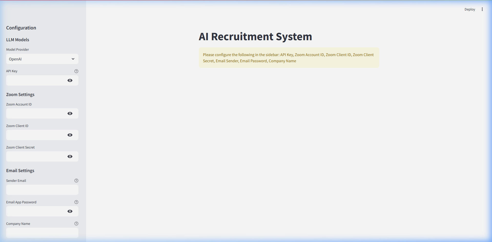
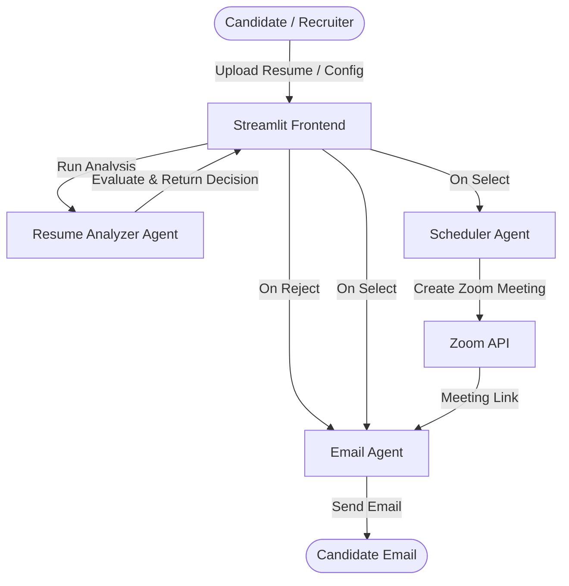

# AI Recruitment System 🚀

[](https://ai-based-recruitment-system-umqhzrr7zfpyxd3ebpqwto.streamlit.app/)

The **AI Recruitment System** is an intelligent, multi-agent assistant designed to automate and streamline the candidate hiring workflow for HR teams and technical recruiters. By leveraging advanced Language Models (LLMs) and Phidata agents, the system automates resume screening, handles candidate email communications, and schedules Zoom interviews.

---

## 🖼️ Application Interface

Here is a preview of the AI Recruitment System user interface:



---

## ✨ Features

- **📄 Dynamic Job Management**: Easily configure new job roles, description requirements, and additional assessment rules directly from the application interface.
- **🤖 Automated AI Resume Evaluation**: Supports leading LLM providers (OpenAI, Anthropic, and Mistral) to thoroughly evaluate uploaded PDF resumes against job requirements (using a recommended 75% compatibility threshold).
- **✉️ Agentic Email Communications**: Automatically drafts and sends friendly, professional selection notifications or constructive rejection/feedback emails.
- **📅 Zoom Interview Scheduler**: Automatically creates Zoom meetings during business hours and emails the join details (including calendar link/timezone conversion info) directly to candidates.

---

## 🧠 Multi-Agent Architecture

The system utilizes **Phidata** to orchestrate three specialized AI agents working together:



1. **Resume Analyzer Agent (Recruiter Persona)**: Analyzes resumes against job requirements and outputs decision metrics (Selection/Rejection, Match Score, Missing Skills, and Feedback) in structured JSON format.
2. **Email Agent (Coordinator Persona)**: Manages candidate email interactions, ensuring emails are empathetic, professional, clear, and perfectly formatted.
3. **Scheduler Agent (Scheduling Coordinator Persona)**: Schedules 60-minute technical interviews using the Zoom API during standard business hours (IST / EST) and feeds meeting invites to the Email Agent.

---

## ⚙️ Prerequisites

To run this application, you will need the following credentials:

### 1. LLM Provider API Keys 🔑
- **OpenAI Key**: [OpenAI Platform](https://platform.openai.com/)
- **Claude Key**: [Anthropic Console](https://console.anthropic.com/)
- **Mistral Key**: [Mistral AI Console](https://console.mistral.ai/)

### 2. Zoom OAuth Credentials 🎥
1. Visit the [Zoom App Marketplace](https://marketplace.zoom.us/).
2. Create a new app using **Server-to-Server OAuth**.
3. Obtain your **Client ID**, **Client Secret**, and **Account ID**.
4. Enable the following scopes for meeting management:
   - `meeting:write:invite_links:admin`
   - `meeting:write:meeting:admin`
   - `meeting:write:meeting:master`
   - `meeting:write:invite_links:master`
   - `meeting:write:open_app:admin`
   - `user:read:email:admin`
   - `user:read:list_users:admin`
   - `billing:read:user_entitlement:admin`

### 3. Gmail App Password 📧
1. Use a standard Gmail account.
2. Enable **2-Step Verification** in your Google Account security settings.
3. Generate an **App Password** (choose *Mail* and *Other (Custom Name)*).
4. Save the 16-character code (use without spaces in the Streamlit App config).

---

## 🛠️ Installation & Running

### Option A: Run Locally (Recommended with `uv`)

This project uses the modern, ultra-fast Python package installer and manager **`uv`**.

1. **Clone the repository**:
   ```bash
   git clone https://github.com/pratiksutar841/AI-Based-Recruitment-System.git
   cd AI-Based-Recruitment-System
   ```

2. **Install `uv`** (if not already installed):
   ```bash
   pip install uv
   ```

3. **Install dependencies and sync virtual environment**:
   ```bash
   uv sync
   ```

4. **Launch the application**:
   ```bash
   uv run streamlit run app.py
   ```
   Open your browser and navigate to `http://localhost:8501`.

---

### Option B: Run with Docker 🐳

#### Build and Run Locally:
1. **Build the image**:
   ```bash
   docker build -t localmachine/ai_recruitment_team:main-latest .
   ```

2. **Run the container**:
   ```bash
   docker run -p 7860:7860 localmachine/ai_recruitment_team:main-latest
   ```

#### Run Prebuilt Image from DockerHub:
1. **Pull the image**:
   ```bash
   docker pull manthan07/ai_recruitment_team:main-latest
   ```

2. **Run the container**:
   ```bash
   docker run -p 7860:7860 manthan07/ai_recruitment_team:main-latest
   ```

---

## 🛠️ Technologies Used

- **Phidata**: Agent orchestration and Tool management.
- **Python**: Core application logic.
- **Streamlit**: Web client interface.
- **Pydantic**: Data schema validation.
- **PyPDF2**: Resume text extraction from PDF.
